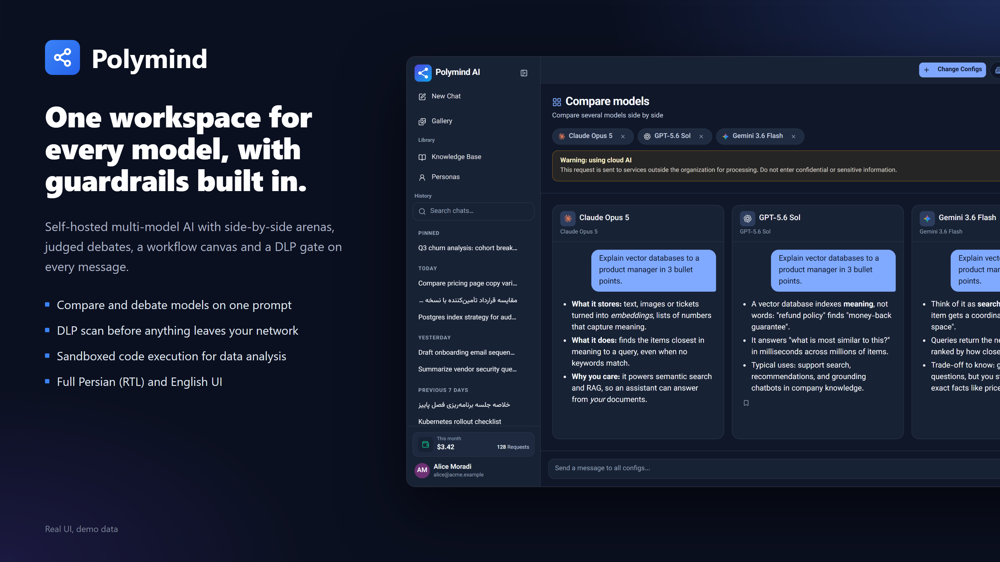
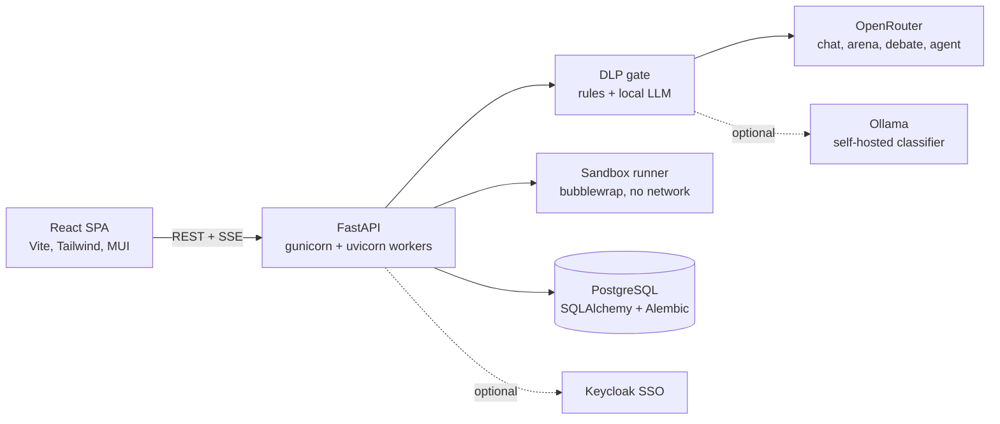
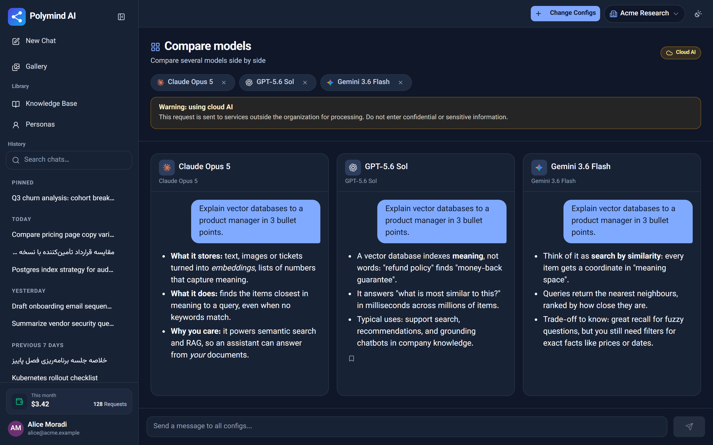
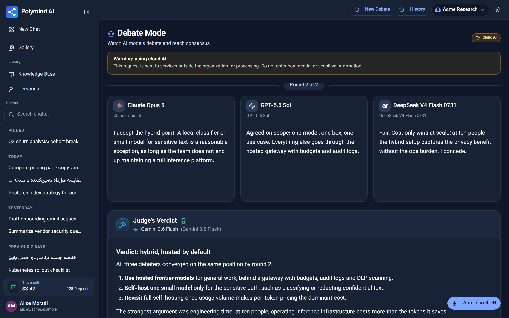
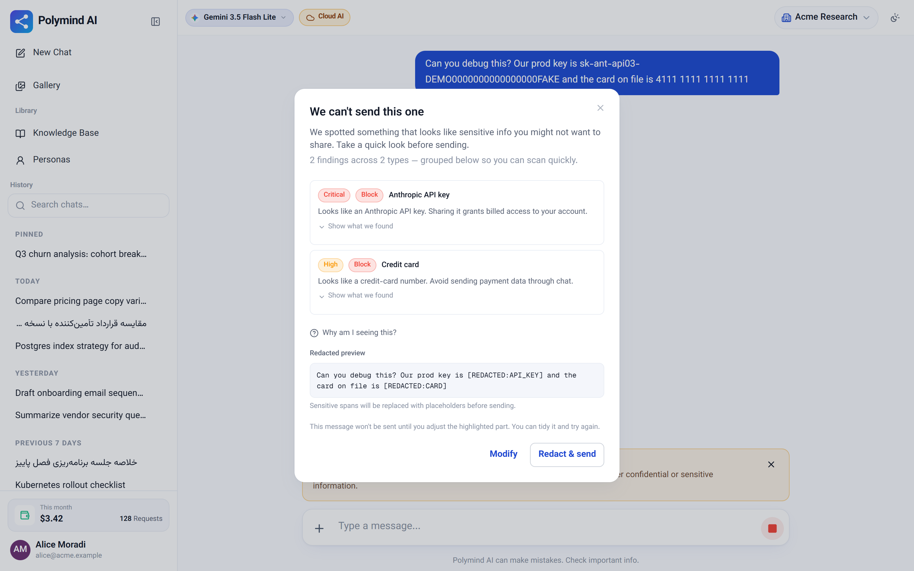
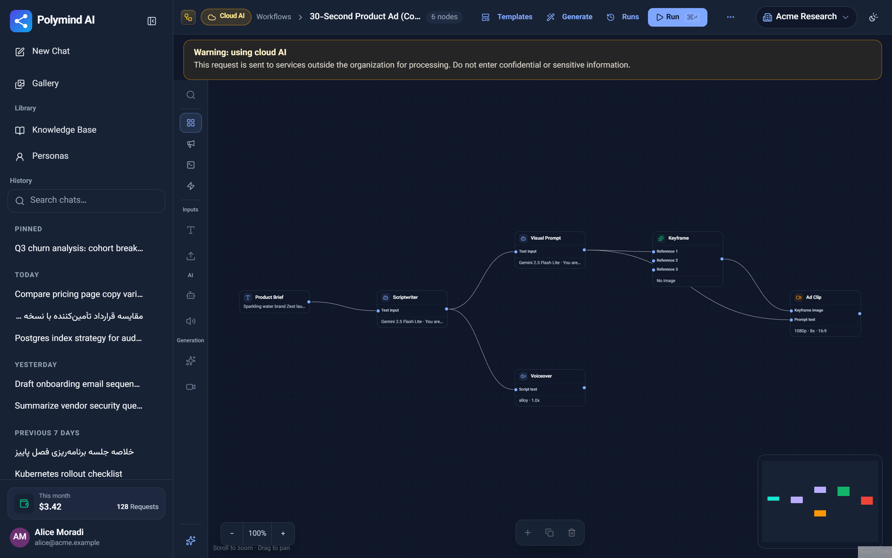
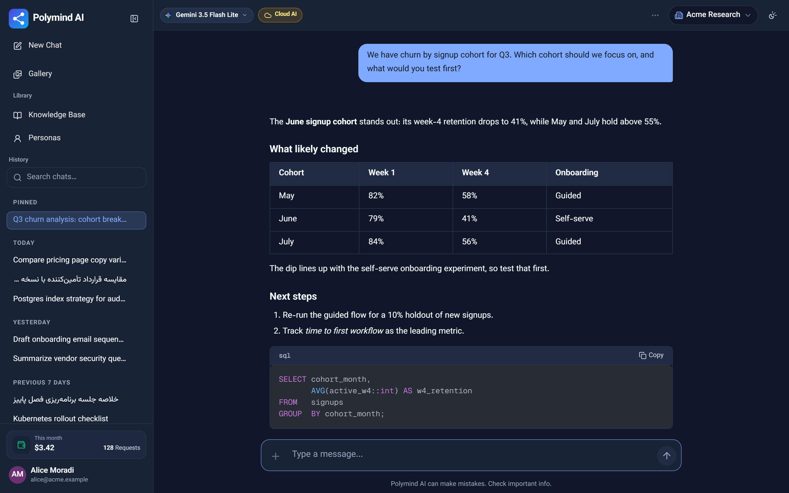
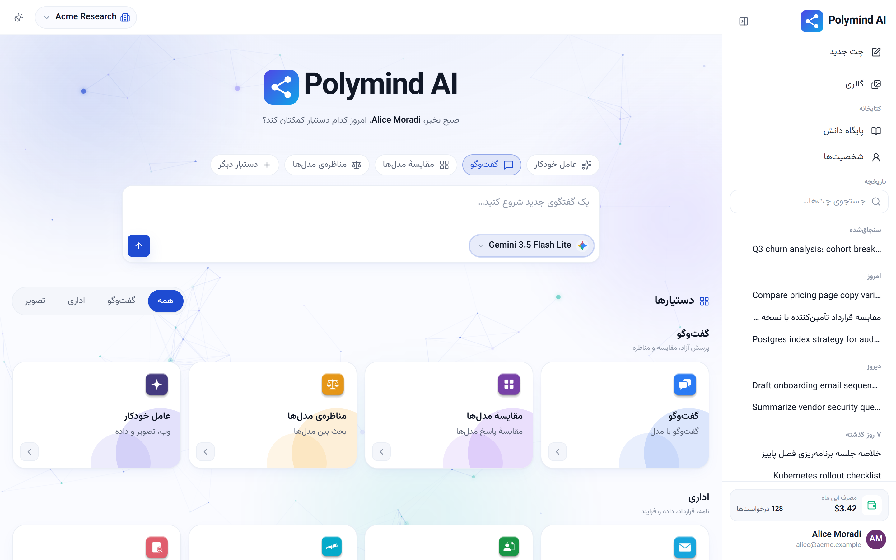
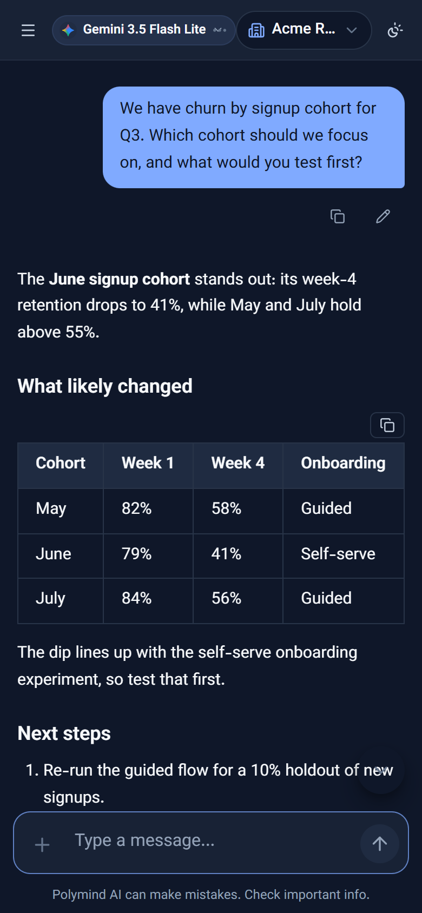

# Polymind



> A self-hosted, multi-model AI workspace with a DLP gate, sandboxed code execution and first-class Persian (RTL) support.


## Highlights

- **Arena and debates:** one prompt, several models side by side, or 2-5 models arguing in rounds while a judge model writes the verdict.
- **DLP before the provider:** every outgoing message is scanned for keys, cards, IBANs and PII; blocks can be redacted and sent in one click.
- **Agents and workflows:** a tool-calling agent plus a node-based canvas that chains text, image, voice and video models.
- **Sandboxed data analysis:** LLM-written pandas code runs under bubblewrap with no network access.
- **Persian-first:** full RTL layout, `fa`/`en` i18n and Persian PDF export.

Polymind puts many LLMs (via [OpenRouter](https://openrouter.ai)) behind one login, with the controls a company needs around them: per-workspace budgets, audit logs, and a data-loss-prevention layer that scans every outgoing message.

## Why it's interesting

- **Model arena and debates.** The same prompt runs against several models side by side (`/arena`), or 2-5 models argue a topic in rounds with a judge model synthesizing a verdict (`backend/app/services/debate_service.py`, including an infinite-round mode that auto-concludes).
- **Agent orchestrator.** A tool-calling agent (`/agent`) routes a request to image generation, data analysis, web search or sub-agents, and asks clarifying questions when it is stuck (`backend/app/services/agent_service.py`, `agent_turn.py`).
- **Sandboxed execution.** The Data Analyzer has the LLM write pandas code and runs it in a dedicated venv under bubblewrap: no network, scrubbed env, read-only data mount, rlimits and a wall-clock kill. It fails closed if no jailer is available (`backend/app/services/sandbox_service.py`, `backend/sandbox/`).
- **DLP gate.** A regex/rule detector (keys, cards, IBANs, PII, custom workspace rules) plus an optional second-pass LLM classifier running on a self-hosted Ollama, so scanned text never has to leave your infrastructure. Enforced server-side at every chokepoint with warn/block policies (`dlp_service.py`, `dlp_gate.py`).
- **Evals.** A labeled English/Persian corpus of ~250 scenarios measures the DLP classifier's category accuracy, including hard semantic and adversarial cases (`backend/eval/dlp_smart_scan/`, `backend/tests/eval/`).
- **Persian support.** RTL UI with Vazirmatn, full `fa`/`en` i18n, Persian PDF export (reshaping + bidi), Persian prompts for the letter writer, contract reviewer, tender and research assistants.

## Architecture



The SPA streams chat, arena and debate over SSE. Every server-side send passes through the DLP gate before any provider call. Code produced by the data agent never runs in the API process: it is handed to the sandbox runner, and only JSON artifacts (tables, charts) come back. Workspaces, budgets and audit logs live in Postgres; Keycloak SSO is optional (`KEYCLOAK_URL` blank disables it).

## Tech stack

- Backend: Python 3.12, FastAPI, SQLAlchemy 2, Alembic, PostgreSQL, gunicorn/uvicorn, httpx
- Frontend: React 18, Vite, Tailwind, MUI, React Query, React Flow, ECharts, i18next
- AI: OpenRouter (any model), optional Ollama for the DLP classifier, browser-use Cloud, ElevenLabs (meeting transcription)
- Tests: pytest (backend), Playwright (frontend e2e)

## Key techniques

| Technique | Where |
|---|---|
| Tool calling / agent loop with clarifying questions | `backend/app/services/agent_service.py`, `agent_turn.py` |
| Multi-model arena and judged debates | `backend/app/api/routers/arena.py`, `debate.py`, `services/debate_service.py` |
| OS-level sandbox for LLM-written code | `backend/app/services/sandbox_service.py`, `backend/sandbox/runner.py` |
| DLP rules + LLM second pass, workspace policy guidance | `backend/app/services/dlp_service.py`, `dlp_rules.py`, `dlp_gate.py` |
| Eval corpus and report builder | `backend/eval/dlp_smart_scan/`, `backend/scripts/eval_dlp_smart_scan.py` |
| Spend gating and credit ledger | `backend/app/services/spend_gate.py` |
| Document extraction, OCR, PPTX/PDF generation | `document_extraction_service.py`, `ocr_service.py`, `pptx_renderer.py`, `chat_export_pdf.py` |

## Getting started

Prerequisites: Python 3.12 with [uv](https://github.com/astral-sh/uv), Node 18+, PostgreSQL, an OpenRouter API key.

```bash
# Backend
cd backend
uv sync
cp .env.example .env        # set SQLALCHEMY_DATABASE_URI, SECRET_KEY, JWT_SECRET_KEY, OPENROUTER_API_KEY
uv run alembic upgrade head
uv run python scripts/seed.py            # prompt + workflow templates
uv run uvicorn main:app --reload --port 5000

# Frontend (second terminal)
cd frontend
pnpm install
pnpm dev
```

Optional: `uv run python scripts/seed_holding.py` seeds a synthetic multi-company demo organization. The sandbox venv setup for the Data Analyzer is described in `backend/sandbox/README.md`.

## Tests and evals

```bash
cd backend && uv run pytest                                  # needs a local Postgres test DB (unichat_test)
cd backend && uv run pytest tests/eval/test_dlp_smart_scan_corpus.py -p no:randomly   # offline corpus validation
cd frontend && pnpm test:e2e                                 # Playwright
```

The live DLP accuracy run needs a reachable Ollama server; see `backend/eval/dlp_smart_scan/README.md`.

## Screenshots

All screenshots show the real React UI with synthetic demo data (fictional "Acme Research" workspace); the API is mocked in the browser, so no model calls were made.

| | |
|---|---|
|  |  |
| **Arena:** three models answer the same prompt side by side. | **Debate:** models argue over two rounds, then a judge model writes the verdict. |
|  |  |
| **DLP gate:** an API key and a card number are caught before sending, with a redacted preview. | **Workflow canvas:** the "30-Second Product Ad" template chains brief, script, image, voiceover and video nodes. |
|  |  |
| **Chat:** markdown tables and highlighted code in the thread view. | **Persian (RTL):** the home hub with the full right-to-left layout. |

<p align="center"></p>

To regenerate them, start the frontend dev server on port 4150 and run `node scripts/capture-screenshots.mjs` from `frontend/`. The script uses Playwright with mocked `/api` responses, so no backend is needed.

## License

MIT, see [LICENSE](./LICENSE).
